# 2526_Projet1A_PcBot_G5

**Objectif :** Concevoir un robot communicant (Swarm) pour la cartographie d'environnement.
**Volume horaire :** 40 heures (10 séances x 4h).

- Travail en groupe réalisé par: Youssef Chemrakhi, Théodore Condette, Rayan Taoussi, Samy, Maoua.

# I - Phase 1 : Conception et Saisie de Schéma
- **Séance 1 : Initialisation & Spécifications**

- **Définition du Besoin**
  - Liste des fonctionnalités
  - Schéma architectural
- **Planification et Matériel**
  - Planning prévisionnel
  - Choix des composants

# 1 - Liste des fonctionnalités
Le robot doit être capable de:
- **Navigation et Évitement d'obstacles :** Détection d'objets en temps réel via les capteurs **VL53L0X (TOF)** pour ajuster la trajectoire.
- **Localisation Relative:** Suivi du déplacement et de l'orientation grâce à la centrale inertielle **LSM6DSOX** (Accéléromètre/Gyroscope).
- **Cartographie Collaborative :** Envoi des points de données de l'environnement vers les autres robots ou une station de base via le module **nRF24**.
- **Gestion de Swarm :** Capacité à recevoir des instructions ou à partager sa position pour éviter que deux robots ne couvrent la même zone.
- **Pilotage de Puissance :** Contrôle précis de la vitesse et de la direction des micro-moteurs **DFR1224** via le driver **DRV8411A**.
- **Autonomie Énergétique :** Recharge sécurisée de la batterie Li-ion et monitoring de la tension via le contrôleur **BQ25896**.

## 1.2 -Détails des composants 

## BMS bq25896

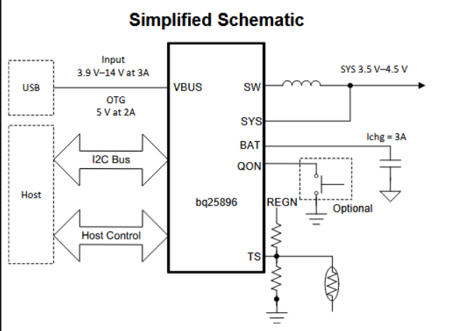

- **C'est quoi ?** Le gestionnaire d'énergie intelligent.
    
- **Sa mission :**
    
    1. Il prend le 5V de l'USB pour charger la batterie LiPo en toute sécurité.
        
    2. Il protège la batterie (surcharge/décharge profonde).
        
    3. Il fournit l'énergie principale (SYS) au reste du robot.
        
- **Pourquoi c'est vital ?** Sans lui, ta batterie LiPo pourrait prendre feu ou mourir prématurément.

### Pin configuration BMS :

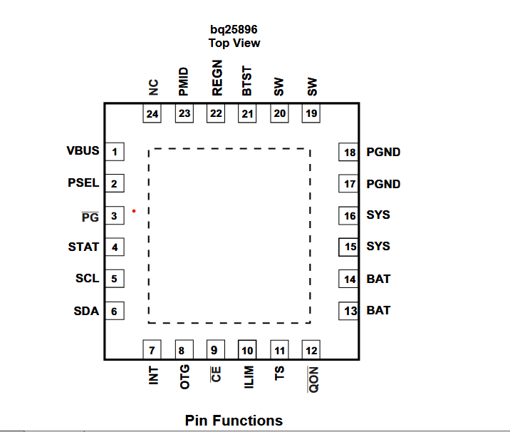

**Netlist:**

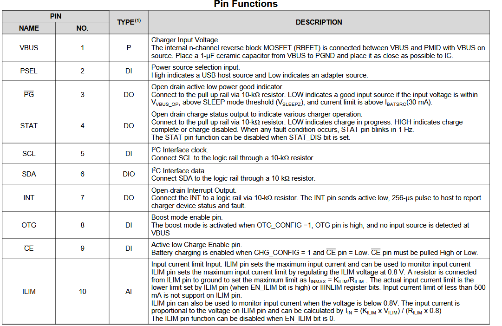

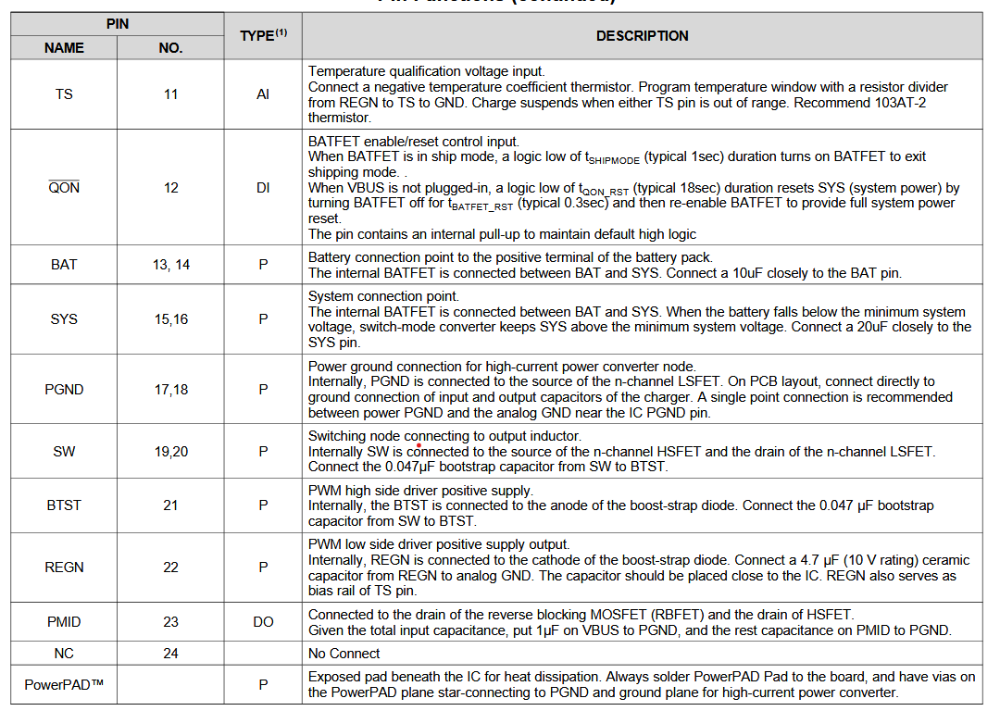

## Motor's Driver DRV8411A 

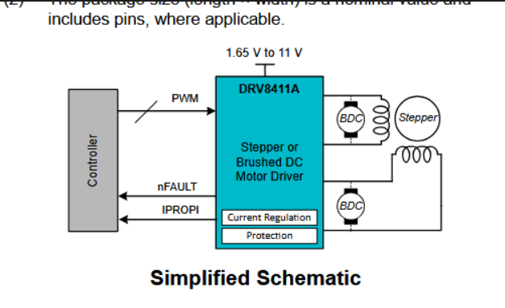

- **C'est quoi ?** L'amplificateur de puissance.
    
- **Sa mission :** Le STM32 est trop faible pour faire tourner les moteurs directement. Le DRV8411A prend les petits ordres logiques (3.3V) et ouvre les vannes du "gros courant" venant de la batterie pour faire tourner les roues.
    
- **Pourquoi c'est vital ?** Il protège le STM32 des retours de courant inductif des moteurs.
### Pin configuration Driver

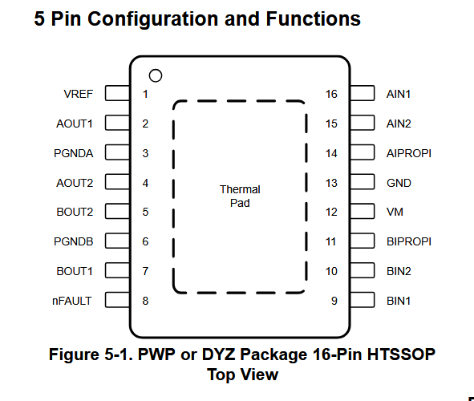

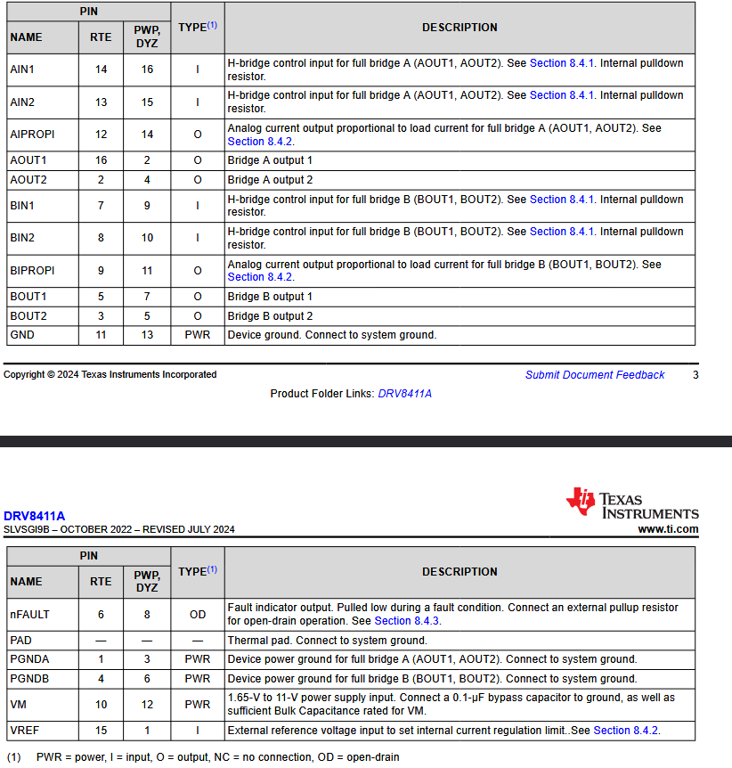

## imu adafruit (centrale inertielle)

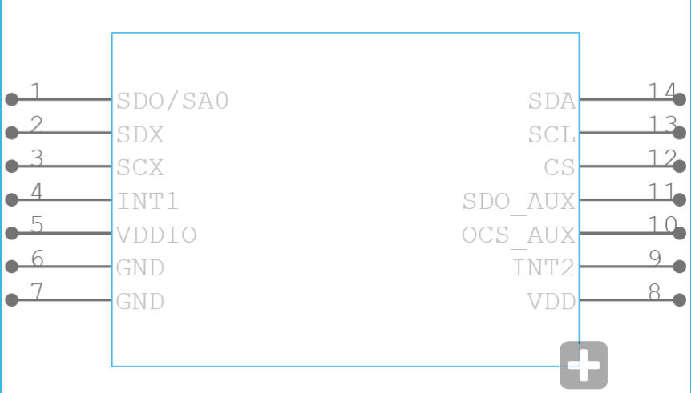
 LSM6DSOX (IMU - Accéléromètre/Gyroscope)

- **C'est quoi ?** Le capteur d'équilibre et de mouvement.
    
- **Sa mission :** Il sent si le robot accélère, tourne, ou s'il cogne un mur (choc). Il permet de faire avancer le robot bien droit (en corrigeant la trajectoire si une roue tourne plus vite que l'autre).
    
### Pin configuration imu

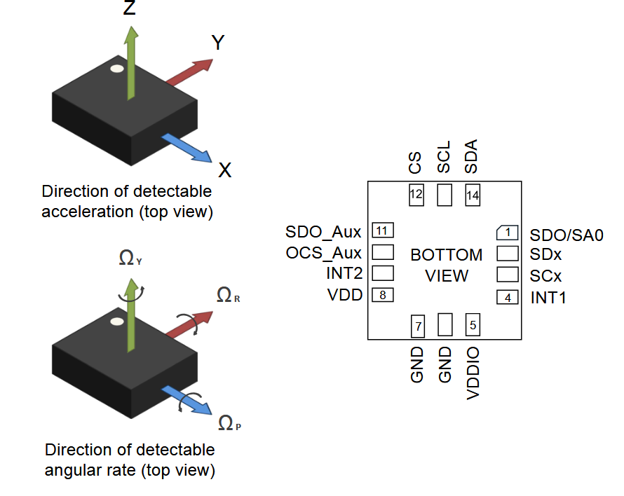

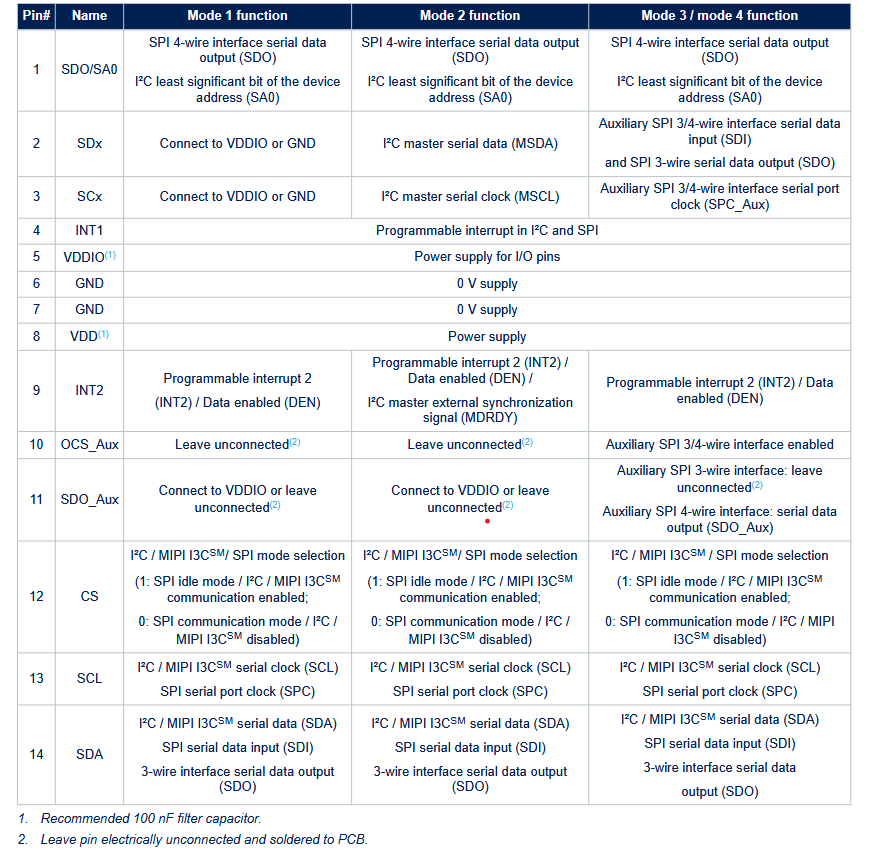

## Tof vl53lx
VL53L0X (ToF - Time of Flight)

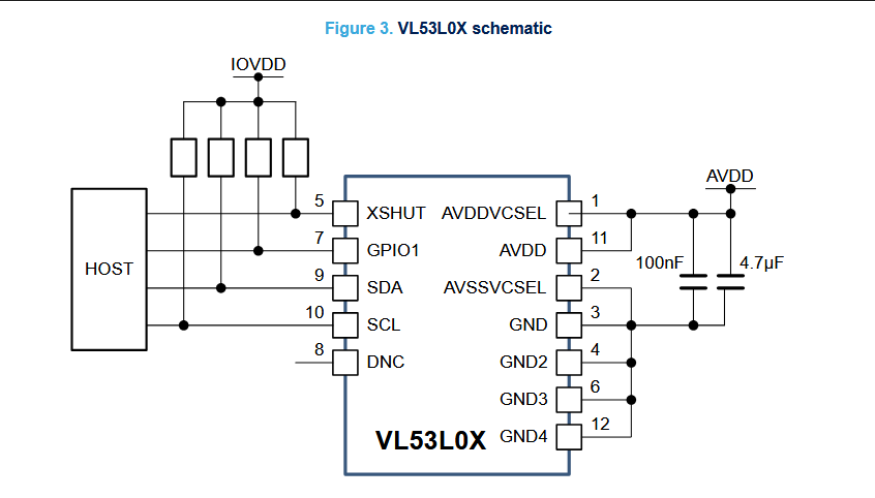

- **C'est quoi ?** Le télémètre laser.
    
- **Sa mission :** Il envoie un rayon de lumière invisible (infrarouge) et mesure le temps qu'il met à revenir. Cela lui donne la distance précise de l'obstacle devant lui (en millimètres).

### Pin configuration tof
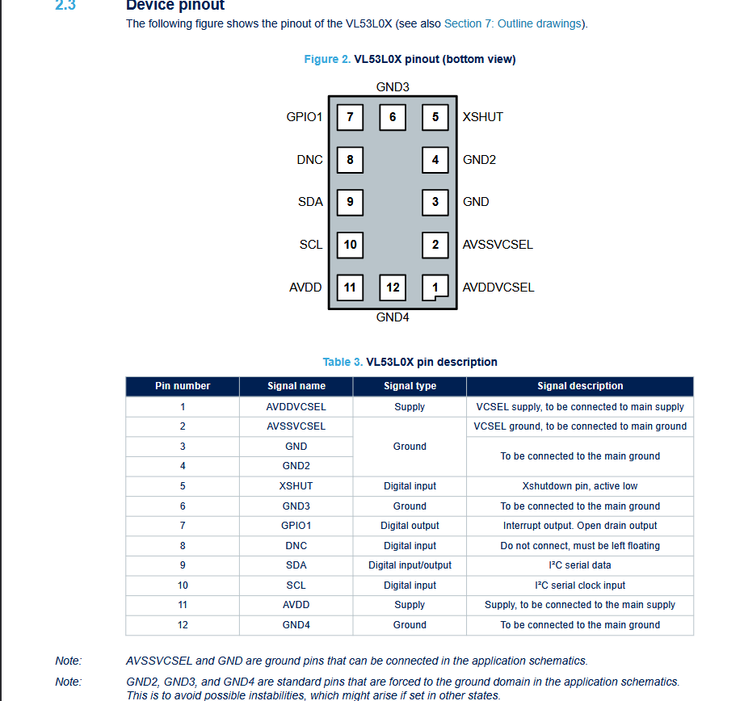
VL53L0X (ToF - Time of Flight)

- **C'est quoi ?** Le télémètre laser.
    
- **Sa mission :** Il envoie un rayon de lumière invisible (infrarouge) et mesure le temps qu'il met à revenir. Cela lui donne la distance précise de l'obstacle devant lui (en millimètres).

## motor DFR1224
(Moteurs N20 3V)

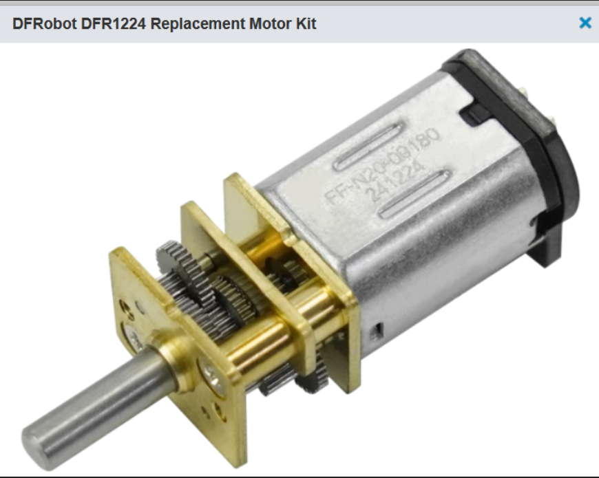

- **C'est quoi ?** Les actionneurs.
    
- **Sa mission :** Convertir l'électricité en mouvement mécanique. Ils ont une boîte de vitesses (engrenages) intégrée pour avoir du couple (force) plutôt que de la vitesse pure.
    
- **Rappel critique :** Ce sont des moteurs **3V**. Ils doivent être alimentés avec précaution via le PWM du driver.
    

## module de communication nRF24l01
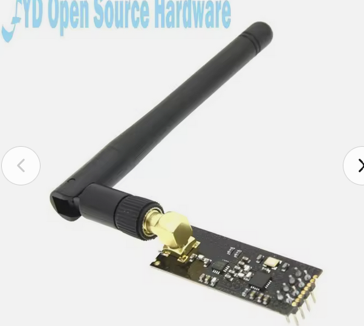

### Pin configuration nrf
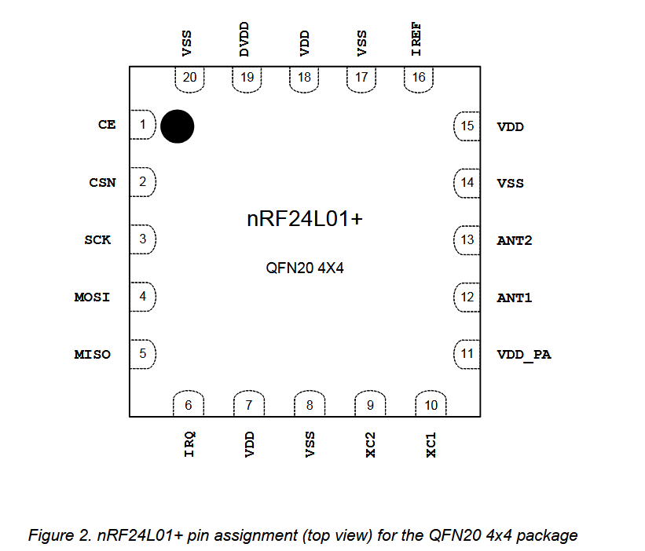

**Netlist**
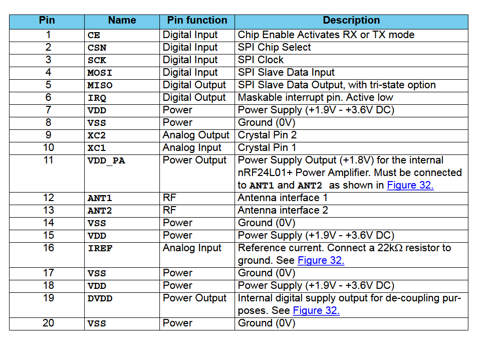

# 2 - Schéma architectural

Le schéma ci-dessous illustre l'organisation du système. Le microcontrôleur (MCU) agit comme le cerveau central, coordonnant les capteurs (entrées), les actionneurs (sorties) et la communication.

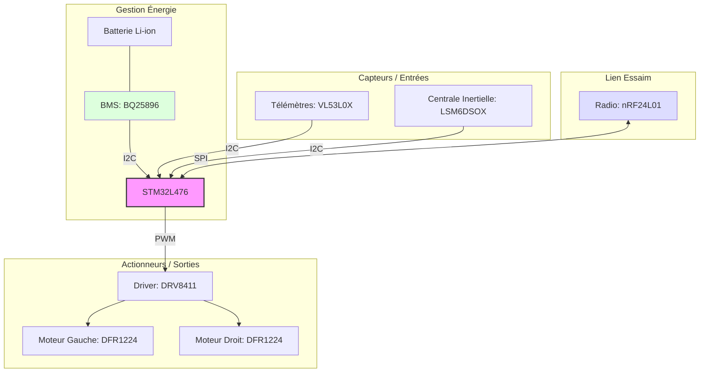

Afin d'assurer les connexions données, on se reposera sur la Datasheet qui nous donne l'ensembles des ports de la STM32L476 qui sont configurés en I2C et SPI:

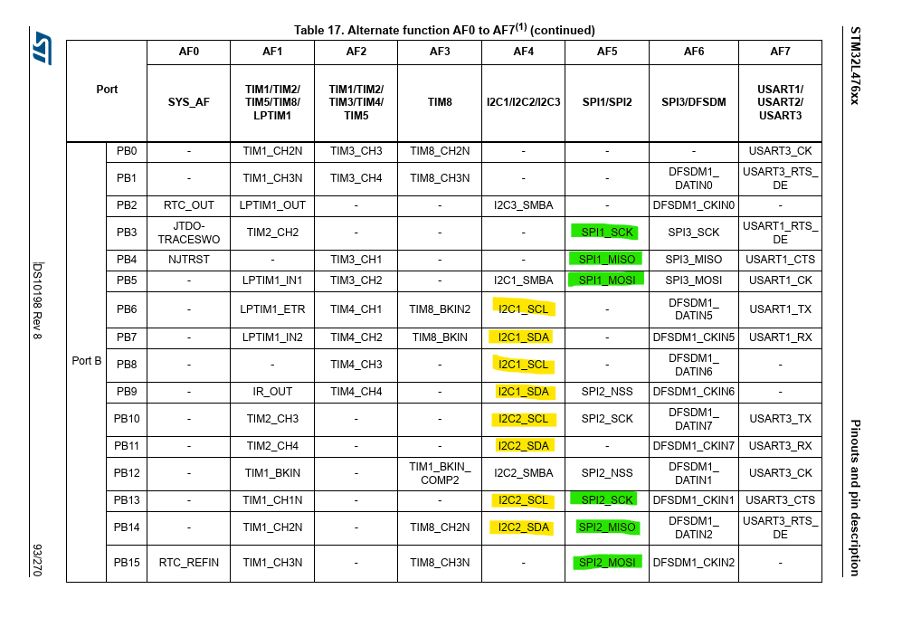

# 3 - Planning Prévisionnel - Projet PCBot

## Phase 1 : Conception et Saisie de Schéma
- **Séance 1 : Initialisation & Spécifications**
  - Formation du groupe.
  - Création du dépôt Git et ajout du professeur (laurent.fiack@ensea.fr).
  - Étude des composants : Capteurs TOF, Accéléromètre, nRF24, Batterie/Chargeur.
- **Séance 2 : Saisie de schéma**
  - Début de la saisie sur KiCad des blocs d'alimentation et du microcontrôleur.
- **Séance 3 : Revue de schéma & Finalisation**
  - Revue critique des connexions.
  - Finalisation du schéma complet avant les vacances de février.

## Phase 2 : Routage et Fabrication
- **Séance 4 : Placement et Routage**
  - Placement des composants sur le PCB.
  - Routage des pistes.
- **Séance 5 : Revue de routage & Commande**
  - **Critique :** Validation finale du routage.
  - Génération et envoi des fichiers de fabrication (Gerber).

## Phase 3 : Firmware et Intégration
- **Séance 6 : Tests préliminaires & Firmware**
  - Tests sur cartes de développement.
  - Développement des drivers pour les capteurs TOF et le module nRF24.
- **Séance 7 : Développement Firmware**
  - Implémentation des algorithmes de cartographie et de communication Swarm.
- **Séance 8 : Firmware & Soudure**
  - Réception possible des PCB.
  - Assemblage (soudure) et tests de continuité.
- **Séance 9 : Intégration Finale & Débogage**
  - Tests en conditions réelles du robot.
  - Correction des derniers bugs du firmware.

## Phase 4 : Clôture
- **Séance 10 : Finitions & Démo**
  - 2h : Préparation finale et finitions.
  - 2h : Présentation et démonstration du projet.

